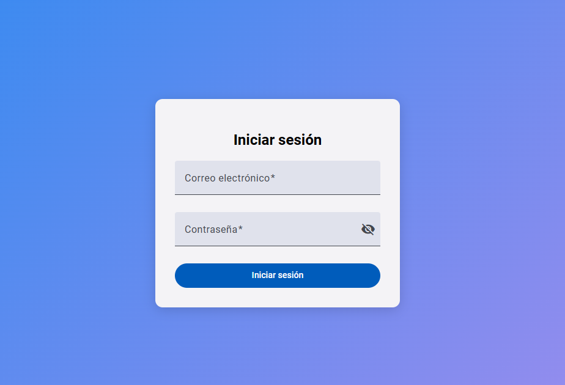

# Proyecto: Login con Validación de Usuarios

Este proyecto consiste en implementar un sistema de autenticación que valide el acceso de los usuarios utilizando un formulario de login. La validación se realiza mediante una API pública, que verifica si el correo electrónico y la contraseña ingresados coinciden con los datos almacenados.

---

## Descripción de la Práctica

1. Consumir la API pública: `https://api.escuelajs.co/api/v1/users`.
2. Validar que el correo electrónico y la contraseña ingresados coincidan con los usuarios registrados en la API.
3. Si las credenciales son correctas:
   - Redirigir al usuario a un **dashboard**.
4. Si las credenciales son incorrectas:
   - Mostrar un mensaje de error en la interfaz.

---

## Vista del Listado de Usuarios



---

## Ejecucion de la aplicacion de manera local

Clona el repositorio

```bash
  git clone https://github.com/BladimirGS/consumo-api-GSHB.git
```

Vamos a la carpeta del proyecto

```bash
  cd consumo-api-GSHB
```

Instalamos dependencias

```bash
  npm install
```

Corremos el servidor de manera loca

```bash
  ng serve
```

---

